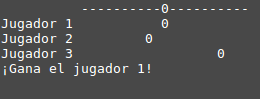

Este es el ejercicio que hice que más me gustó en el curso.
Se trata del ejercicio de examen de recuperación del primer trimestre, que realicé 3 versiones.
 
 - La primera de las versiones es con variables para todo y de manera normal.
 
    
    
    
 - La segunda de las versiones es con arrays.
 
 - La tercera es distinta a las dos anteriores, dado que en las anteriores el boliche (bola pequeña que se lanza al comienzo del juego) 
 tiene una posición fija, dada esa posición se calcula el ganador de la partida, pero en esta versión hago que el lanzamiento del boliche sea aleatorio
 y a raiz de esa posición se calcula el ganador de los tres jugadores.
